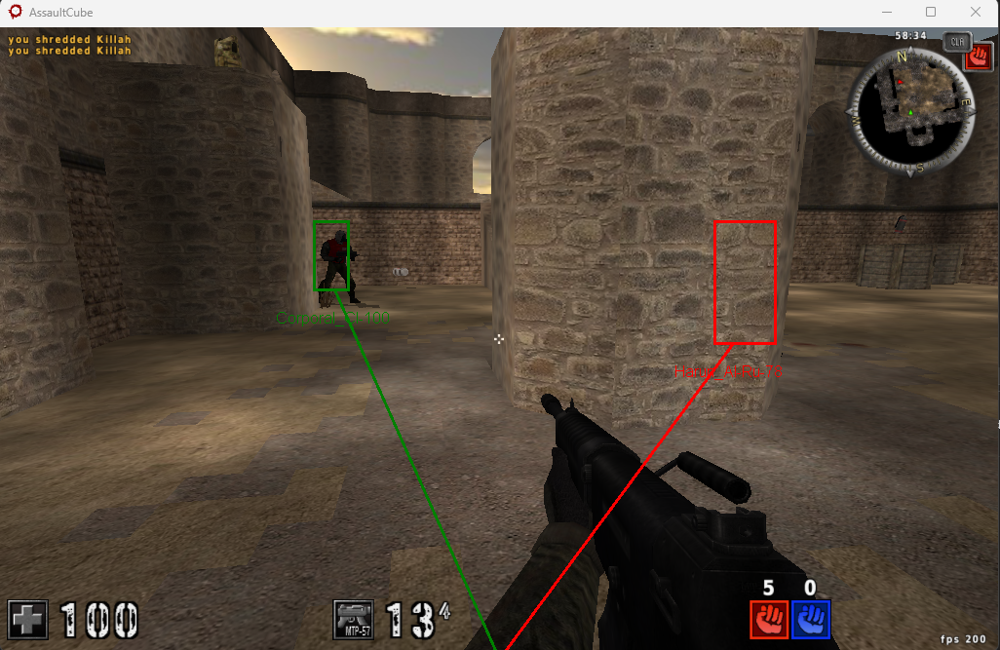

Features
1. ReadLocalPlayer
Retrieves information about the local player, including view angles.
2. ReadEntity
Reads data from a given entity's base address, including health, ammo, position, and player name.
3. ReadEntities
Reads information for multiple entities in the game world, filtering out entities with zero health.
4. CalculateAngles
Calculates the angles required to aim from one entity to another.
5. Aim
Writes aiming angles to a specified entity's memory.
6. CalcDistance
Calculates the distance between two entities.
7. CalcMag
Calculates the magnitude between two entities.
8. WorldToScreen
Converts world coordinates to screen coordinates using the provided ViewMatrix.
9. CalcRect
Calculates a rectangle based on entity foot and head positions.

